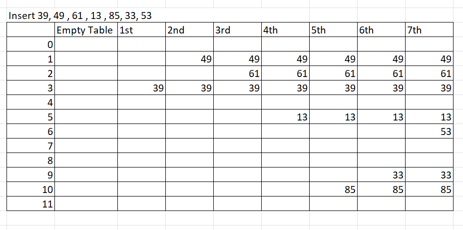
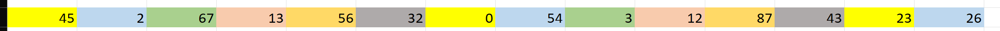
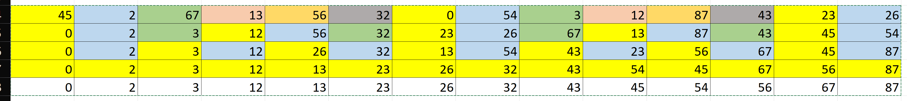
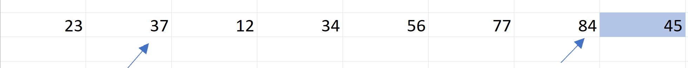
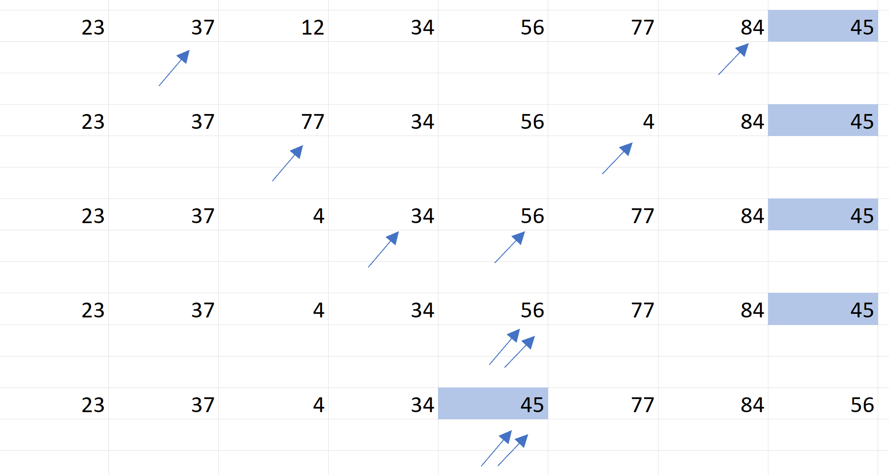

# Quiz 4 Practice Answers

1) Which key and collision method is the following using? Write the code that finds the position.




Is using a Hashset with a key % Tablesize with a quadratic collision.
```java
private int findPos( Hashable x )
        {
/* 1*/      int collisionNum = 0;
/* 2*/      int currentPos = x.hash( array.length );

/* 3*/      while( array[ currentPos ] != null &&
                    !array[ currentPos ].element.equals( x ) )
            {
/* 4*/          currentPos += 2 * ++collisionNum - 1;  // Compute ith probe
/* 5*/          if( currentPos >= array.length )       // Implement the mod
/* 6*/              currentPos -= array.length;
            }

/* 7*/      return currentPos;
        }

```

2) Continue this sort by hand step by step and write the code for it.





```java
 public static void shellsort( Comparable [ ] a )
    {
        for( int gap = 6; gap > 0;
                     gap = gap == 2 ? 1 : (int) ( gap / 2.2 ) )
            for( int i = gap; i < a.length; i++ )
            {
                Comparable tmp = a[ i ];
                int j = i;

                for( ; j >= gap && tmp.compareTo( a[ j - gap ] ) < 0; j -= gap )
                    a[ j ] = a[ j - gap ];
                a[ j ] = tmp;
            }
    }

```


3) Continue this part by hand and write the code for it. use int low, int high as inputs.




```java
   private static void partition( Comparable [ ] a, int low, int high )
    {
           // Sort low, middle, high
            int middle = ( low + high ) / 2;
            if( a[ middle ].compareTo( a[ low ] ) < 0 )
                swapReferences( a, low, middle );
            if( a[ high ].compareTo( a[ low ] ) < 0 )
                swapReferences( a, low, high );
            if( a[ high ].compareTo( a[ middle ] ) < 0 )
                swapReferences( a, middle, high );
            // Place pivot at position high - 1
            swapReferences( a, middle, high - 1 );
            Comparable pivot = a[ high - 1 ];

                // Begin partitioning
            int i, j;
            for( i = low, j = high - 1; ; )
            {
                while( a[ ++i ].compareTo( pivot ) < 0 )
                    ;
                while( pivot.compareTo( a[ --j ] ) < 0 )
                    ;
                if( i >= j )
                    break;
                swapReferences( a, i, j );
            }

                // Restore pivot
            swapReferences( a, i, high - 1 );
    }

```
